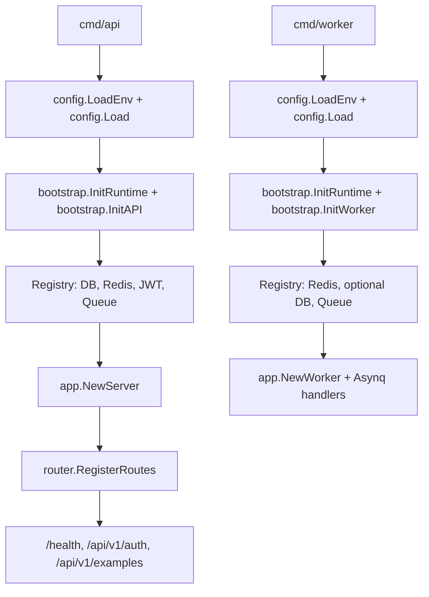

# Go Skeleton

[中文](./README_zh.md) | **English**

This is a clean Go service skeleton extracted from the original project shape.
Business modules were intentionally removed; the only domain-like code left is
the `Example` flow used to demonstrate the app layers.

**Requires Go 1.26+.**

## Structure

- `cmd/api`: HTTP API process.
- `cmd/worker`: Asynq worker process.
- `cmd/migrate`: minimal GORM migration entrypoint for the example table.
- `config`: environment loading and typed configuration values.
- `internal/bootstrap`: process-level resource initialization and lifecycle.
- `internal`: application wiring, routes, middleware, and example layers.
- `pkg`: reusable infrastructure helpers, including generic JWT auth.

## Run

The fastest path on a fresh clone:

```sh
cp .env.example .env
make dev-up          # boots Postgres + Redis via docker compose
go run ./cmd/migrate # creates the example table
go run ./cmd/api     # serves on :3000
```

Run the worker when Redis is configured:

```sh
go run ./cmd/worker
```

Stop the local dependencies (data volumes are preserved):

```sh
make dev-down
```

Or build a container image from the included multi-stage `Dockerfile`:

```sh
make docker-build        # build go-skeleton-api:dev (default CMD_TARGET=api)
make docker-run          # run it locally, talking to make dev-up dependencies
```

`CMD_TARGET=worker make docker-build` and `CMD_TARGET=migrate make docker-build`
reuse the same `Dockerfile` for the other two processes.

## Using this Skeleton

Steps to take after cloning this repo as the starting point of a new service:

1. Pick a new module path and rename it everywhere:

   ```sh
   go mod edit -module github.com/your-org/your-service
   # Update import paths from go-skeleton -> github.com/your-org/your-service
   find . -type f -name '*.go' -not -path './internal/oapi/*' \
     -exec sed -i '' 's|go-skeleton|github.com/your-org/your-service|g' {} +
   make oapi   # regenerate oapi.gen.go with the new import path
   ```

2. Set production-safe values in `.env`:
   - `JWT_SECRET` (mandatory; the default is a placeholder)
   - `JWT_ISSUER` (rename from `go-skeleton`)
   - `POSTGRES`, `REDIS_ADDR` if not using `make dev-up`

3. Delete or rename the `Example` module once your real module is wired up:
   - `internal/handler/example.go`, `internal/service/example.go`,
     `internal/repository/example.go`, `internal/model/example.go`
   - `internal/task/example.go`, `internal/worker/handler.go` (Asynq registration)
   - The `/api/v1/examples*` paths in `api/openapi.yaml`
   - Tests that reference `Example`

4. Add a new module by copying the `Example` shape:
   - Define the request/response in `api/openapi.yaml`, run `make oapi`.
   - Add `handler` → `service` → `repository` → `model` files matching the pattern.
   - Wire it in `internal/server.go::newHTTPHandlers` and `internal/router/router.go`.
   - Worker side: register the task in `internal/task/` and the handler in
     `internal/worker/handler.go`.

5. Make sure CI is happy:

   ```sh
   make verify   # fmt + vet + test + lint + oapi-verify
   ```

## Runtime Dependencies

- The API process requires `POSTGRES`.
- Redis is optional for the API process. When configured, it enables cache and queue publishing.
- The worker process requires `REDIS_ADDR`.
- Postgres is optional for the worker process.
- JWT auth example routes are enabled when `JWT_SECRET` is configured.

## Example API

Issue a sample JWT (dev-only endpoint, off by default — set
`AUTH_DEV_TOKEN_ENABLED=true` in your local `.env` to enable):

```sh
curl -X POST http://127.0.0.1:3000/api/v1/auth/token \
  -H 'Content-Type: application/json' \
  -d '{"subject":"demo"}'
```

Call the protected example endpoint:

```sh
curl http://127.0.0.1:3000/api/v1/auth/me \
  -H "Authorization: Bearer <access_token>"
```

Publish the sample async task when Redis is configured:

```sh
curl -X POST http://127.0.0.1:3000/api/v1/examples/tasks \
  -H 'Content-Type: application/json' \
  -d '{"name":"demo"}'
```

## Startup Flow



## API Contract

The service ships with an OpenAPI 3.1 spec at `api/openapi.yaml`. At runtime
the embedded spec is served as JSON at:

```
GET /openapi.json
```

Import it into Postman, Bruno, Insomnia, or any OpenAPI-aware tool to explore
the API. The spec is the single source of truth for request/response shapes;
the generated `internal/oapi/oapi.gen.go` enforces it at compile time via
`oapi.ServerInterface`.

Regenerate after editing `api/openapi.yaml`:

```sh
make oapi          # regenerate internal/oapi/oapi.gen.go
make oapi-verify   # fail if generated code is out of sync (used by make verify)
```

## Deployment Notes

- The OpenAPI spec is generated at build time from `api/openapi.yaml`; the
  generated `internal/oapi/oapi.gen.go` is checked into the repo, so deployment
  does not need to run codegen.
- `CORS_ALLOW_ORIGINS` is a comma-separated allow list. Empty means no CORS allow headers.
- Replace `JWT_SECRET` before using the auth example outside local development.
- API business errors use the JSON envelope `code`, `msg`, and `reason`; most API errors are returned with HTTP 200 by convention.
- `/health` uses real HTTP status codes and returns 503 when required dependencies are unavailable.

## Verify

Run the one-shot check that gates every commit:

```sh
make verify   # fmt + vet + test + lint + oapi-verify
```

Or call the underlying targets individually (`make test`, `make lint`, ...).
See `make help` for the full list.

## License

[MIT](./LICENSE).
