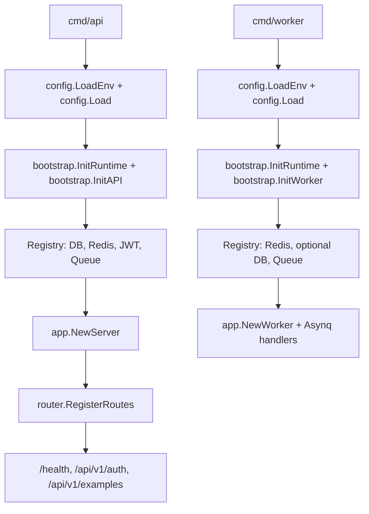

# Go Skeleton

[中文](./README_zh.md) | **English**

This is a clean Go service skeleton extracted from the original project shape.
Business modules were intentionally removed; the only domain-like code left is
the `Example` flow used to demonstrate the app layers.

**Requires Go 1.26+.**

## Structure

- `cmd/api`: HTTP API process.
- `cmd/worker`: Asynq worker process.
- `cmd/migrate`: minimal GORM migration entrypoint for the example table.
- `config`: environment loading and typed configuration values.
- `internal/bootstrap`: process-level resource initialization and lifecycle.
- `internal`: application wiring, routes, middleware, and example layers.
- `pkg`: reusable infrastructure helpers, including generic JWT auth.

## Run

```sh
cp .env.example .env
go run ./cmd/api
```

Run the worker when Redis is configured:

```sh
go run ./cmd/worker
```

Run the example migration when Postgres is configured:

```sh
go run ./cmd/migrate
```

## Runtime Dependencies

- The API process requires `POSTGRES`.
- Redis is optional for the API process. When configured, it enables cache and queue publishing.
- The worker process requires `REDIS_ADDR`.
- Postgres is optional for the worker process.
- JWT auth example routes are enabled when `JWT_SECRET` is configured.

## Example API

Issue a sample JWT:

```sh
curl -X POST http://127.0.0.1:3000/api/v1/auth/token \
  -H 'Content-Type: application/json' \
  -d '{"subject":"demo"}'
```

Call the protected example endpoint:

```sh
curl http://127.0.0.1:3000/api/v1/auth/me \
  -H "Authorization: Bearer <access_token>"
```

Publish the sample async task when Redis is configured:

```sh
curl -X POST http://127.0.0.1:3000/api/v1/examples/tasks \
  -H 'Content-Type: application/json' \
  -d '{"name":"demo"}'
```

## Startup Flow



## API Contract

The service ships with an OpenAPI 3.1 spec at `api/openapi.yaml`. At runtime
the embedded spec is served as JSON at:

```
GET /openapi.json
```

Import it into Postman, Bruno, Insomnia, or any OpenAPI-aware tool to explore
the API. The spec is the single source of truth for request/response shapes;
the generated `internal/oapi/oapi.gen.go` enforces it at compile time via
`oapi.ServerInterface`.

Regenerate after editing `api/openapi.yaml`:

```sh
make oapi          # regenerate internal/oapi/oapi.gen.go
make oapi-verify   # fail if generated code is out of sync (used by make verify)
```

## Deployment Notes

- The OpenAPI spec is generated at build time from `api/openapi.yaml`; the
  generated `internal/oapi/oapi.gen.go` is checked into the repo, so deployment
  does not need to run codegen.
- `CORS_ALLOW_ORIGINS` is a comma-separated allow list. Empty means no CORS allow headers.
- Replace `JWT_SECRET` before using the auth example outside local development.
- API business errors use the JSON envelope `code`, `msg`, and `reason`; most API errors are returned with HTTP 200 by convention.
- `/health` uses real HTTP status codes and returns 503 when required dependencies are unavailable.

## Verify

Run the one-shot check that gates every commit:

```sh
make verify   # fmt + vet + test + lint + oapi-verify
```

Or call the underlying targets individually (`make test`, `make lint`, ...).
See `make help` for the full list.

## License

[MIT](./LICENSE).
