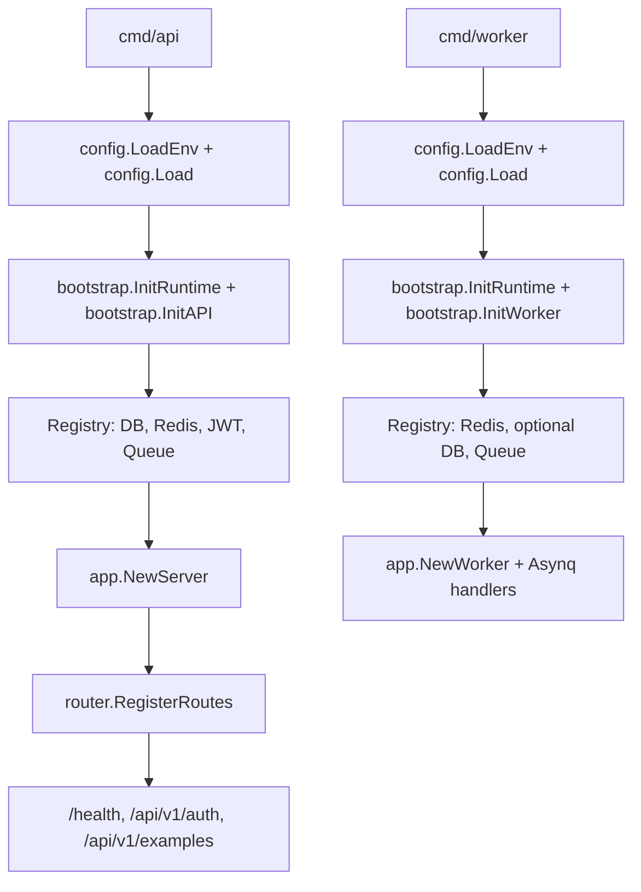

# Go Skeleton

**中文** | [English](./README_en.md)

这是一份从实际项目里抽离出来的 Go 服务骨架。业务模块已经清空，仅保留 `Example` 流程作为分层结构的示例。

**需要 Go 1.26+。**

## 目录结构

- `cmd/api`：HTTP API 进程。
- `cmd/worker`：Asynq worker 进程。
- `cmd/migrate`：基于 goose 的版本化 SQL 迁移入口（迁移文件在 `migrations/`）。
- `config`：环境变量加载与配置类型。
- `internal/bootstrap`：进程级资源初始化与生命周期管理。
- `internal`：应用装配、路由、中间件以及 example 分层代码。
- `pkg`：通用基础设施工具，包含通用 JWT 鉴权。

## 运行

新仓库最快上手路径：

```sh
cp .env.example .env
```

依赖（Postgres + Redis）二选一启动——都跟 `.env.example` 端口 / 凭证对齐：

### A. 用 docker compose（推荐，零配置）

```sh
make dev-up          # 起 Postgres + Redis 容器
make run-migrate     # 跑迁移 up（建表）；回滚/状态见 docs/runbook.md
go run ./cmd/api     # 监听 :3000
```

### B. 用本机已装的 Postgres + Redis（不用 docker）

```sh
# macOS:
brew install postgresql@17 redis && brew services start postgresql@17 && brew services start redis
# Linux (apt): sudo apt install -y postgresql-17 redis-server && sudo systemctl enable --now postgresql redis-server

# 建与 .env.example 对齐的 user / db（见 docs/runbook.md 详细命令）
make dev-deps-check  # 探活 Postgres :5432 + Redis :6379，不通会给出装包提示
make run-migrate
go run ./cmd/api
```

配置好 Redis 后另开一个终端跑 worker：

```sh
go run ./cmd/worker
```

停掉本地 docker 依赖（数据卷保留）：

```sh
make dev-down
```

或者用仓库自带的 multi-stage `Dockerfile` 构建镜像：

```sh
make docker-build        # 构建 go-skeleton-api:dev（默认 CMD_TARGET=api）
make docker-run          # 在本地运行，并连到 make dev-up 起的依赖
```

`CMD_TARGET=worker make docker-build`、`CMD_TARGET=migrate make docker-build` 复用同一个 `Dockerfile` 打另外两个进程的镜像。

生产环境的容器编排（迁移当独立 Job / Helm hook 跑、滚动升级、回滚、并发安全）见 [`docs/deploy.md` §10](./docs/deploy.md#10-docker--k8s-路径)；本节只讲本地起步。

## 复制 skeleton 后要改什么

把这个仓库当作新服务的起点时，请按下面的顺序改：

1. 跑一次性 rename 脚本，把所有 `go-skeleton` 字样换掉：

   ```sh
   ./scripts/rename.sh github.com/your-org/your-service your-service
   #                    ^^^^^^^^^^^^^^^^^^^^^^^^^^^^^^^ ^^^^^^^^^^^^
   #                    NEW_MODULE                      NEW_SHORTNAME
   ```

   脚本会改：Go import、`go.mod`、Makefile 变量、`.env.example`、
   `.golangci.yml`、OpenAPI title、systemd unit 文件名+内容、
   `docker-compose` 容器名、JWT issuer 默认值、测试 fixture；
   结束前会跑 `make fmt + vet + test + lint + docs-verify` 确认没问题，
   再列出需要手改的少量残留（systemd 里的 Documentation= 上游 URL、
   注释里的 skeleton 历史说明）。

   审 diff、commit 之后把脚本删掉：

   ```sh
   git rm scripts/rename.sh && git commit -m 'chore: drop rename script (one-shot)'
   ```

2. 在 `.env` 里替换生产安全的值：
   - `JWT_SECRET`（必改，默认值是占位符）
   - 不用 `make dev-up` 时改 `POSTGRES`、`REDIS_ADDR`

3. 真实模块跑通后，删掉或改名 `Example` 模块：
   - `internal/handler/example.go`、`internal/service/example.go`、
     `internal/repository/example.go`、`internal/model/example.go`
   - `internal/task/example.go`、`internal/worker/handler.go`（Asynq 注册处）
   - `api/openapi.yaml` 里的 `/api/v1/examples*` 路径
   - 引用 `Example` 的测试

4. 按 `Example` 模板新增模块：
   - 在 `api/openapi.yaml` 里加 request/response，跑 `make oapi`
   - 按 handler → service → repository → model 的分层补文件
   - 在 `internal/server.go::newHTTPHandlers` 装配、`internal/router/router.go` 注册路由
   - Worker 端：在 `internal/task/` 定义任务类型，在 `internal/worker/handler.go` 注册 handler

5. 保证 CI 全绿：

   ```sh
   make verify   # fmt + vet + test + lint + oapi-verify + docs-verify + docs-deploy-check + docs-errcodes-verify
   ```

## 运行时依赖

- API 进程必需 `POSTGRES`。
- Redis 对 API 进程可选；配置后会启用缓存与异步任务投递。
- Worker 进程必需 `REDIS_ADDR`。
- Postgres 对 worker 进程可选。
- 配置 `JWT_SECRET` 后才会启用 JWT 示例路由。

## 示例 API

签发示例 JWT（dev-only 端点，默认关闭——在本地 `.env` 设
`AUTH_DEV_TOKEN_ENABLED=true` 才暴露）：

```sh
curl -X POST http://127.0.0.1:3000/api/v1/auth/token \
  -H 'Content-Type: application/json' \
  -d '{"subject":"demo"}'
```

调用需要鉴权的示例接口：

```sh
curl http://127.0.0.1:3000/api/v1/auth/me \
  -H "Authorization: Bearer <access_token>"
```

Redis 已配置时投递示例异步任务：

```sh
curl -X POST http://127.0.0.1:3000/api/v1/examples/tasks \
  -H 'Content-Type: application/json' \
  -d '{"name":"demo"}'
```

## 启动流程



## API 契约

服务自带一份 OpenAPI 3.1 spec，位于 `api/openapi.yaml`。运行时通过下面的端点暴露：

```
GET /openapi.json   # 内嵌的 spec（JSON），供工具导入（仅非生产）
GET /docs           # Stoplight Elements 在线文档页（依赖外网 CDN，仅非生产）
```

`/openapi.json` 可导入 Postman / Bruno / Insomnia 或任意支持 OpenAPI 的工具浏览接口。`/docs` 用 Stoplight Elements 渲染同一份 spec，可在浏览器直接浏览/调试；它依赖外网 CDN，内网/离线环境无法渲染。调试时在浏览器 console 执行 `localStorage.setItem('go_skeleton_token','<jwt>')`，刷新后 TryIt 发出的请求会自动带 `Authorization` 头。文档页外观可通过启动期 `DOCS_*` env 调整（标题、主题 light/dark/system、布局、隐藏 TryIt/Schemas、logo，默认值见 `.env.example`）。spec 是请求/响应结构的唯一真相源；生成的 `internal/oapi/oapi.gen.go` 通过 `oapi.ServerInterface` 在编译期强制对齐。

`APP_ENV=production` 时这两条路由**都不注册**（访问得到 404），隐藏 API 契约与文档 UI，减少信息泄露面；本地/预发等非生产环境正常暴露。

修改 `api/openapi.yaml` 后重新生成：

```sh
make oapi          # 重新生成 internal/oapi/oapi.gen.go
make oapi-verify   # 生成产物与 yaml 不一致时失败（make verify 会调用）
```

## 上线前检查清单

把真实流量打进来之前，请逐项核对：

- [ ] `APP_ENV=production`。这会启用启动期安全 guard：下面所有标 **拦** 的项不合规进程直接 fail-fast 退出；标 **warn** 的项启动时会通过 `config.ProductionWarnings` 集中打日志提醒，不阻止启动但裸暴露公网时大概率是漏配。把它当成"清单的自动执行器"，但不替代你逐项核对。
- [ ] **拦** `JWT_SECRET` 替换成高熵随机值（≥ 32 字节，例：`openssl rand -base64 48`）。`APP_ENV=production` 下占位值 / 空 / 过短会被拦。
- [ ] **拦** `AUTH_DEV_TOKEN_ENABLED=false`（路由仍然注册，会返回 `SERVICE_DISABLED`）。`APP_ENV=production` 下设 true 会被拦。
- [ ] **拦** `GIN_MODE=release`。`APP_ENV=production` 下非 release 会被拦（debug/test 会把详细路由表 + panic stack 吐到响应里）。
- [ ] **拦** `LOG_FORMAT=json`。`APP_ENV=production` 下非 json 会被拦（console 格式日志采集器解析不了）。
- [ ] `CORS_ALLOW_ORIGINS` 显式枚举，不要留空、不要 `*`。
- [ ] **warn** `TRUSTED_PROXIES` 配置成实际的 LB 网段；否则 `c.ClientIP()` 会退回 `RemoteAddr`，LB 后面的部署会把所有客户端识别成代理 IP，限流和审计日志都失真。裸直连无 LB 时可空。
- [ ] **warn** `RATE_LIMIT_PER_MINUTE` 设置成非零值，匹配业务流量预算；上游有 LB/WAF 限流时可保持 0。
- [ ] **warn** `METRICS_ADDR` 设置成独立地址（如 `127.0.0.1:9090`），让 `/metrics` 与业务 API 在 L4 层就隔离。空值时 `/metrics` 挂在业务端口，公网暴露会顺带泄露指标。
- [ ] K8s liveness 接 `/livez`，readiness 接 `/health`。**不要**把 liveness 指向 `/health`——DB 抖一下会把健康 Pod 杀掉重启。
- [ ] 根据实例规格和 Postgres `max_connections` 调 `DB_MAX_OPEN_CONNS` / `DB_MAX_IDLE_CONNS` / `DB_CONN_MAX_LIFETIME`，默认值（30 / 15 / 30m）是开发档位，不是生产档位。
- [ ] API 启动前先跑 `go run ./cmd/migrate`（goose up，应用 `migrations/` 待执行迁移）。
- [ ] 想清楚是否部署 worker 进程：有 `*/tasks` 接口暴露但没消费者，任务会越堆越多。

## 部署

支持两种路径：

### 容器

走 multi-stage [`Dockerfile`](./Dockerfile)（`make docker-build` / `make docker-run`）。同一份 Dockerfile 通过 `CMD_TARGET` build-arg 也能打 `worker` / `migrate` 镜像。

### 二进制 + systemd

`make build-linux` 出 Linux 静态二进制（`make release` 顺便打 tarball + `SHA256SUMS`）。主机初始化、systemd unit 安装、滚动升级、回滚、journald 日志查询的完整步骤见 [`docs/deploy.md`](./docs/deploy.md)。

每次推 `v*` tag 时 GitHub Actions 会自动发布 `linux-amd64` / `linux-arm64` tarball（见 [`.github/workflows/release.yml`](./.github/workflows/release.yml)）。二进制通过 ldflags 内嵌 `version` / `commit` / `build_time`，能从 `<binary> -version`、`/livez` 的 `version` 字段、`/health` 的 `build` 对象三处读到。

### 通用约定（两条路径都适用）

- OpenAPI spec 在构建期就已从 `api/openapi.yaml` 生成完毕，`internal/oapi/oapi.gen.go` 入库，部署时不需要再跑 codegen。
- `CORS_ALLOW_ORIGINS` 是逗号分隔的白名单；留空表示不下发 CORS 响应头。
- 离开本地开发前请替换 `JWT_SECRET`。
- 业务接口的错误用 JSON 信封 `code` / `message` / `reason` 返回；按约定，绝大多数 API 错误也用 HTTP 200。
- `/livez` 是 liveness 探针（永远 200），`/health` 是 readiness 探针，依赖不可用时返回 503。

## 开发工作流

- 叙事性指南（从克隆到 PR 的时间线，含分层规则 / 测试 / commit 风格 / CI）：
  [`docs/development.md`](./docs/development.md)
- 命令查表（按场景的 cheat sheet：新增 endpoint / 任务 / 排错等）：
  [`docs/runbook.md`](./docs/runbook.md)
- 二进制部署（systemd / 滚动升级 / 回滚）：
  [`docs/deploy.md`](./docs/deploy.md)

## 校验

提交前跑一站式检查：

```sh
make verify   # fmt + vet + test + lint + oapi-verify + docs-verify + docs-deploy-check + docs-errcodes-verify
```

也可以单独跑某一项（`make test`、`make lint` 等），完整列表见 `make help`。

## Changelog

变更记录见 [CHANGELOG.md](./CHANGELOG.md)，按 [Keep a Changelog](https://keepachangelog.com/) 格式手工维护。不引入自动化工具——做改动时顺手把变更追加到 `Unreleased` 段即可。

## License

[MIT](./LICENSE).
