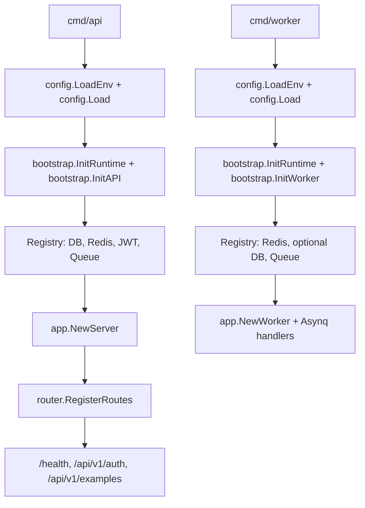

# Go Skeleton

[中文](./README.md) | **English**

This is a clean Go service skeleton extracted from the original project shape.
Business modules were intentionally removed; the only domain-like code left is
the `Example` flow used to demonstrate the app layers.

**Requires Go 1.26+.**

## Structure

- `cmd/api`: HTTP API process.
- `cmd/worker`: Asynq worker process.
- `cmd/migrate`: goose-based versioned SQL migration entrypoint (files in `migrations/`).
- `config`: environment loading and typed configuration values.
- `internal/bootstrap`: process-level resource initialization and lifecycle.
- `internal`: application wiring, routes, middleware, and example layers.
- `pkg`: reusable infrastructure helpers, including generic JWT auth.

## Run

The fastest path on a fresh clone:

```sh
cp .env.example .env
```

Pick one path for dependencies (Postgres + Redis) — both align with `.env.example` ports / credentials:

### A. Use docker compose (recommended, zero config)

```sh
make dev-up          # boot Postgres + Redis containers
make run-migrate     # migrate up (create tables); rollback/status in docs/runbook.md
go run ./cmd/api     # serves on :3000
```

### B. Use host-installed Postgres + Redis (no docker)

```sh
# macOS:
brew install postgresql@17 redis && brew services start postgresql@17 && brew services start redis
# Linux (apt): sudo apt install -y postgresql-17 redis-server && sudo systemctl enable --now postgresql redis-server

# Create user / db matching .env.example (full commands in docs/runbook.md)
make dev-deps-check  # probe Postgres :5432 + Redis :6379, prints install hints if unreachable
make run-migrate
go run ./cmd/api
```

Run the worker in another terminal when Redis is configured:

```sh
go run ./cmd/worker
```

Stop the local docker dependencies (data volumes are preserved):

```sh
make dev-down
```

Or build a container image from the included multi-stage `Dockerfile`:

```sh
make docker-build        # build go-skeleton-api:dev (default CMD_TARGET=api)
make docker-run          # run it locally, talking to make dev-up dependencies
```

`CMD_TARGET=worker make docker-build` and `CMD_TARGET=migrate make docker-build`
reuse the same `Dockerfile` for the other two processes.

Production container orchestration (running migrations as a standalone Job / Helm
hook, rolling upgrades, rollback, concurrency safety) is covered in
[`docs/deploy.md` §10](./docs/deploy.md#10-docker--k8s-路径); this section only covers
local bootstrapping.

## Using this Skeleton

Steps to take after cloning this repo as the starting point of a new service:

1. Run the one-shot rename script to re-brand everything in one go:

   ```sh
   ./scripts/rename.sh github.com/your-org/your-service your-service
   #                    ^^^^^^^^^^^^^^^^^^^^^^^^^^^^^^^ ^^^^^^^^^^^^
   #                    NEW_MODULE                      NEW_SHORTNAME
   ```

   This rewrites Go imports, `go.mod`, Makefile vars, `.env.example`,
   `.golangci.yml`, OpenAPI title, systemd unit filenames + contents,
   `docker-compose` container names, JWT issuer defaults, and test fixtures.
   It runs `make fmt + vet + test + lint + docs-verify` to confirm the
   rewrite builds and lints, then prints a small list of remaining manual
   touch-ups (Documentation= URLs in systemd units, comments referencing
   the skeleton's history).

   After reviewing the diff and committing, delete the script:

   ```sh
   git rm scripts/rename.sh && git commit -m 'chore: drop rename script (one-shot)'
   ```

2. Set production-safe values in `.env`:
   - `JWT_SECRET` (mandatory; the default is a placeholder)
   - `POSTGRES`, `REDIS_ADDR` if not using `make dev-up`

3. Delete or rename the `Example` module once your real module is wired up:
   - `internal/handler/example.go`, `internal/service/example.go`,
     `internal/repository/example.go`, `internal/model/example.go`
   - `internal/task/example.go`, `internal/worker/handler.go` (Asynq registration)
   - The `/api/v1/examples*` paths in `api/openapi.yaml`
   - Tests that reference `Example`

4. Add a new module by copying the `Example` shape:
   - Define the request/response in `api/openapi.yaml`, run `make oapi`.
   - Add `handler` → `service` → `repository` → `model` files matching the pattern.
   - Wire it in `internal/server.go::newHTTPHandlers` and `internal/router/router.go`.
   - Worker side: register the task in `internal/task/` and the handler in
     `internal/worker/handler.go`.

5. Make sure CI is happy:

   ```sh
   make verify   # fmt + vet + test + lint + oapi-verify + docs-verify + docs-deploy-check + docs-errcodes-verify
   ```

## Runtime Dependencies

- The API process requires `POSTGRES`.
- Redis is optional for the API process. When configured, it enables cache and queue publishing.
- The worker process requires `REDIS_ADDR`.
- Postgres is optional for the worker process.
- JWT auth example routes are enabled when `JWT_SECRET` is configured.

## Example API

Issue a sample JWT (dev-only endpoint, off by default — set
`AUTH_DEV_TOKEN_ENABLED=true` in your local `.env` to enable):

```sh
curl -X POST http://127.0.0.1:3000/api/v1/auth/token \
  -H 'Content-Type: application/json' \
  -d '{"subject":"demo"}'
```

Call the protected example endpoint:

```sh
curl http://127.0.0.1:3000/api/v1/auth/me \
  -H "Authorization: Bearer <access_token>"
```

Publish the sample async task when Redis is configured:

```sh
curl -X POST http://127.0.0.1:3000/api/v1/examples/tasks \
  -H 'Content-Type: application/json' \
  -d '{"name":"demo"}'
```

## Startup Flow



## API Contract

The service ships with an OpenAPI 3.1 spec at `api/openapi.yaml`. At runtime
it is exposed through the following endpoints:

```
GET /openapi.json   # embedded spec (JSON), for tool import (non-production only)
GET /docs           # Stoplight Elements docs UI (needs public CDN, non-production only)
```

`/openapi.json` can be imported into Postman, Bruno, Insomnia, or any
OpenAPI-aware tool to explore the API. `/docs` renders the same spec with
Stoplight Elements for in-browser browsing/testing; it depends on a public CDN
and won't render in an air-gapped/offline environment. For debugging, run
`localStorage.setItem('go_skeleton_token','<jwt>')` in the browser console —
after a refresh, TryIt requests carry the `Authorization` header automatically.
The docs page appearance is configurable via startup `DOCS_*` env vars (title,
theme light/dark/system, layout, hide TryIt/Schemas, logo; defaults in
`.env.example`). The spec is the single source of truth for request/response
shapes; the generated `internal/oapi/oapi.gen.go` enforces it at compile time
via `oapi.ServerInterface`.

When `APP_ENV=production`, **neither route is registered** (requests get a 404),
hiding the API contract and docs UI to reduce the information-disclosure
surface; non-production environments (local, staging) expose them as usual.

Regenerate after editing `api/openapi.yaml`:

```sh
make oapi          # regenerate internal/oapi/oapi.gen.go
make oapi-verify   # fail if generated code is out of sync (used by make verify)
```

## Production Checklist

Tick these off before pointing real traffic at this service:

- [ ] Replace `JWT_SECRET` with a high-entropy value (≥ 32 bytes, e.g. `openssl rand -base64 48`).
- [ ] Set `AUTH_DEV_TOKEN_ENABLED=false` (the route stays registered and returns `SERVICE_DISABLED`).
- [ ] Set `GIN_MODE=release` so Gin omits debug-mode warnings.
- [ ] Set `LOG_FORMAT=json` (the console format is human-friendly but unparseable by log shippers).
- [ ] Make `CORS_ALLOW_ORIGINS` an explicit allow-list; never leave it on `*` or as a wide pattern.
- [ ] Configure `TRUSTED_PROXIES` to match your load balancer; otherwise `c.ClientIP()` returns the wrong address and rate limits / audit logs lose accuracy.
- [ ] Set `RATE_LIMIT_PER_MINUTE` to a non-zero value matching your traffic budget.
- [ ] Wire `/livez` to the Kubernetes liveness probe and `/health` to the readiness probe. Do not point liveness at `/health` — a DB blip would restart healthy pods.
- [ ] Size `DB_MAX_OPEN_CONNS` / `DB_MAX_IDLE_CONNS` / `DB_CONN_MAX_LIFETIME` for your instance and Postgres `max_connections` budget. The defaults (30 / 15 / 30m) are tuned for development, not production.
- [ ] Run `go run ./cmd/migrate` (goose up, applies pending `migrations/`) before the API process starts.
- [ ] Decide on the worker process: deploy it separately if any `*/tasks` endpoints are reachable, otherwise queued tasks accumulate without consumers.

## Deployment

Two supported paths:

### Container

Use the multi-stage [`Dockerfile`](./Dockerfile) (`make docker-build` /
`make docker-run`). The same Dockerfile produces images for `api`, `worker`,
and `migrate` via the `CMD_TARGET` build-arg.

### Binary (systemd)

Static Linux binaries are produced with `make build-linux` (or `make release`
to also produce tarballs + `SHA256SUMS`). Step-by-step host setup, systemd
unit installation, rolling upgrades, rollback, and journald log queries are
in [`docs/deploy.md`](./docs/deploy.md).

GitHub Releases attach `linux-amd64` / `linux-arm64` tarballs automatically
on every `v*` tag push (see [`.github/workflows/release.yml`](./.github/workflows/release.yml)).
Binaries embed `version`, `commit`, and `build_time` via ldflags — surfaces
via `<binary> -version`, the `/livez` `version` field, and the `/health`
`build` object.

### Notes (both paths)

- The OpenAPI spec is generated at build time from `api/openapi.yaml`; the
  generated `internal/oapi/oapi.gen.go` is checked into the repo, so deployment
  does not need to run codegen.
- `CORS_ALLOW_ORIGINS` is a comma-separated allow list. Empty means no CORS allow headers.
- Replace `JWT_SECRET` before using the auth example outside local development.
- API business errors use the JSON envelope `code`, `message`, and `reason`; most API errors are returned with HTTP 200 by convention.
- `/livez` is the liveness probe (always 200); `/health` is the readiness probe and returns 503 when required dependencies are unavailable.

## Development workflow

- Narrative guide (timeline from clone to PR, with layering rules / tests /
  commit style / CI): [`docs/development.md`](./docs/development.md)
- Command cheat sheet (per-scenario: add endpoint / task / troubleshoot):
  [`docs/runbook.md`](./docs/runbook.md)
- Binary deployment (systemd / rolling upgrade / rollback):
  [`docs/deploy.md`](./docs/deploy.md)

## Verify

Run the one-shot check that gates every commit:

```sh
make verify   # fmt + vet + test + lint + oapi-verify + docs-verify + docs-deploy-check + docs-errcodes-verify
```

Or call the underlying targets individually (`make test`, `make lint`, ...).
See `make help` for the full list.

## Changelog

User-visible changes are tracked in [CHANGELOG.md](./CHANGELOG.md), kept by
hand in the [Keep a Changelog](https://keepachangelog.com/) format. No
automation — just append to the `Unreleased` section as part of the PR that
makes the change.

## License

[MIT](./LICENSE).
