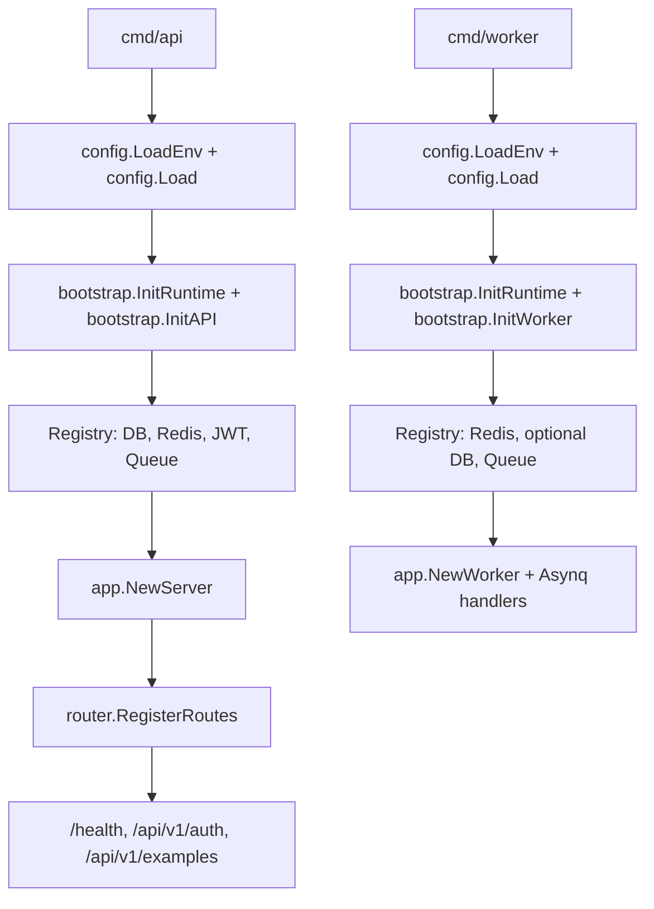

# Go Skeleton

[中文](./README.md) | **English**

This is a Go service skeleton extracted from a real project. Business modules have been cleared out; only the `Example` flow is kept as a reference for the layered structure.

**Requires Go 1.26+.**

## Structure

- `cmd/api`: HTTP API process.
- `cmd/worker`: Asynq worker process.
- `cmd/migrate`: goose-based versioned SQL migration entrypoint (files in `migrations/`).
- `config`: environment loading and typed configuration values.
- `internal/bootstrap`: process-level resource initialization and lifecycle.
- `internal`: application wiring, routes, middleware, and example layers.
- `pkg`: reusable infrastructure helpers, including generic JWT auth.

## Run

The fastest path on a fresh clone:

```sh
cp .env.example .env
```

Pick one path for dependencies (Postgres + Redis) — both align with `.env.example` ports / credentials:

### A. Use docker compose (recommended, zero config)

```sh
make dev-up          # start Postgres + Redis containers
make run-migrate     # migrate up (create tables); rollback/status in docs/runbook.md
go run ./cmd/api     # listens on :3000
```

### B. Use host-installed Postgres + Redis (no docker)

```sh
# macOS:
brew install postgresql@17 redis && brew services start postgresql@17 && brew services start redis
# Linux (apt): sudo apt install -y postgresql-17 redis-server && sudo systemctl enable --now postgresql redis-server

# Create user / db matching .env.example (full commands in docs/runbook.md)
make dev-deps-check  # probe Postgres :5432 + Redis :6379, prints install hints if unreachable
make run-migrate
go run ./cmd/api
```

Run the worker in another terminal once Redis is configured:

```sh
go run ./cmd/worker
```

Or run migration + API + Worker together in the foreground (Ctrl-C drains both):

```sh
make dev-all      # probe deps → migrate → spawn API + Worker, log prefixed [api] / [worker]
```

Stop the local docker dependencies (data volumes are preserved):

```sh
make dev-down
```

Or build a container image from the included multi-stage `Dockerfile`:

```sh
make docker-build        # build go-skeleton-api:dev (default CMD_TARGET=api)
make docker-run          # run it locally, talking to make dev-up dependencies
```

`CMD_TARGET=worker make docker-build` and `CMD_TARGET=migrate make docker-build` reuse the same `Dockerfile` to build images for the other two processes.

Production container orchestration (running migrations as a standalone Job / Helm hook, rolling upgrades, rollback, concurrency safety) is covered in [`docs/deploy.md` §10](./docs/deploy.md#10-docker--k8s-路径); this section only covers local bootstrapping.

## Using this Skeleton

Steps to take after cloning this repo as the starting point for a new service:

1. Run the one-shot rename script to replace every `go-skeleton` reference:

   ```sh
   ./scripts/rename.sh github.com/your-org/your-service your-service \
                       github.com/your-org/your-service
   #                    ^^^^^^^^^^^^^^^^^^^^^^^^^^^^^^^^ ^^^^^^^^^^^^  ^^^^^^^^^^^^^^^^^^^^^^^^^^^^^^^^
   #                    NEW_MODULE                       NEW_SHORTNAME NEW_REPO_URL (optional; falls back to NEW_MODULE)
   ```

   The script rewrites: Go imports, `go.mod`, Makefile variables, `.env.example`,
   `.golangci.yml`, the OpenAPI title, systemd unit filenames + contents
   (including `Documentation=` upstream URLs), `docker-compose` container names,
   the JWT issuer default, test fixtures, Kubernetes labels / namespace /
   `kubectl` commands, release tarball filenames / cosign verify URLs, and
   user / group / chown / install -o/-g shell commands.
   It then runs `make fmt + vet + test + lint + docs-verify` to confirm nothing
   broke, and prints any remaining `go-skeleton` mentions for you to review by hand.

   The default mode keeps literal `go-skeleton` mentions in README / docs
   (they describe the upstream skeleton, not your fork). Pass `RENAME_BARE=1`
   to scrub those too; CHANGELOG history entries are always preserved.

   Review the diff, commit, then delete the script:

   ```sh
   git rm scripts/rename.sh && git commit -m 'chore: drop rename script (one-shot)'
   ```

2. Set production-safe values in `.env`:
   - `JWT_SECRET` (mandatory; the default is a placeholder)
   - `POSTGRES`, `REDIS_ADDR` when not using `make dev-up`

3. After your real module is wired up, drop or rename the `Example` module:
   - `internal/handler/example.go`, `internal/service/example.go`,
     `internal/repository/example.go`, `internal/model/example.go`
   - `internal/task/example.go`, `internal/worker/handler.go` (Asynq registration)
   - The `/api/v1/examples*` paths in `api/openapi.yaml`
   - Tests referencing `Example`

4. Add a new module via the yaml-driven workflow:
   - Define the request/response in `api/openapi.yaml`. Use camelCase `operationId`
     (`listOrders` / `createOrder` / `getOrder`). Add `security: [{ bearerAuth: [] }]`
     when the operation requires auth. When the action name cannot be derived,
     add the yaml extension `x-handler-method: <Action>`.
   - Run `make oapi` to regenerate `internal/oapi/oapi.gen.go`.
   - Run `make new-endpoint NAME=<Name>` — the script reads the yaml, generates
     the 5-layer skeleton + test templates, and injects `internal/server.go` /
     `internal/router/router.go` / `internal/handler/openapi.go::APIServer`.
     Generated `service` / `repository` methods return
     `errcode.NotImplementedYet` (9005), so the repo stays `make verify`-green
     immediately; swap in real logic when you implement. `DRY_RUN=1` only prints
     the plan without writing files; `DTO=1` also derives request DTO structs
     from yaml schemas + injects `ShouldBind...` in handlers.
   - Fill in business logic: handler `c.ShouldBind...`, service rules, repository
     SQL, model fields. Async tasks: define the type in `internal/task/` and
     register the handler in `internal/worker/handler.go`.
   - Debug yaml ↔ code drift with `make new-endpoint-check` (read-only).

5. Keep CI green:

   ```sh
   make verify   # fmt + vet + test + lint + architecture-verify + env-verify + tidy-verify + oapi-verify + docs-verify + docs-deploy-check + docs-errcodes-verify + shell-verify
   ```

## Runtime Dependencies

- The API process requires `POSTGRES`.
- Redis is optional for the API process. When configured, it enables cache and queue publishing.
- The worker process requires `REDIS_ADDR`.
- Postgres is optional for the worker process.
- JWT auth example routes are enabled only when `JWT_SECRET` is configured.

## Example API

Issue a sample JWT (dev-only endpoint, off by default — set
`AUTH_DEV_TOKEN_ENABLED=true` in your local `.env` to enable):

```sh
curl -X POST http://127.0.0.1:3000/api/v1/auth/token \
  -H 'Content-Type: application/json' \
  -d '{"subject":"demo"}'
```

Call the protected example endpoint:

```sh
curl http://127.0.0.1:3000/api/v1/auth/me \
  -H "Authorization: Bearer <access_token>"
```

Publish the sample async task when Redis is configured:

```sh
curl -X POST http://127.0.0.1:3000/api/v1/examples/tasks \
  -H 'Content-Type: application/json' \
  -d '{"name":"demo"}'
```

## Startup Flow



## API Contract

The service ships with an OpenAPI 3.1 spec at `api/openapi.yaml`. At runtime it is exposed via:

```
GET /openapi.json   # embedded spec (JSON), for tool import (non-production only)
GET /docs           # Stoplight Elements docs UI (needs public CDN, non-production only)
```

`/openapi.json` can be imported into Postman / Bruno / Insomnia or any OpenAPI-aware tool to explore the API. `/docs` renders the same spec with Stoplight Elements for in-browser browsing/testing; it depends on a public CDN and won't render in an air-gapped/offline environment. For debugging, run `localStorage.setItem('go_skeleton_token','<jwt>')` in the browser console — after a refresh, TryIt requests carry the `Authorization` header automatically. The docs page appearance is configurable via startup `DOCS_*` env vars (title, theme light/dark/system, layout, hide TryIt/Schemas, logo; defaults in `.env.example`), rendered once at startup in `handler.NewOpenAPIHandler`. The spec is the single source of truth for request/response shapes; the generated `internal/oapi/oapi.gen.go` enforces it at compile time via `oapi.ServerInterface`.

When `APP_ENV=production`, **neither route is registered** (requests get a 404), hiding the API contract and docs UI to reduce the information-disclosure surface; non-production environments (local, staging) expose them as usual.

Regenerate after editing `api/openapi.yaml`:

```sh
make oapi          # regenerate internal/oapi/oapi.gen.go
make oapi-verify   # fail if the generated code is out of sync (used by make verify)
```

## Production Checklist

Tick these off before pointing real traffic at this service:

- [ ] `APP_ENV=production`. This enables startup safety guards: items marked **block** below cause fail-fast exit when misconfigured; items marked **warn** are logged at startup by `config.ProductionWarnings` but do not stop the process. Treat this as the checklist's automated executor — it does not replace going through every item by hand.
- [ ] **block** Replace `JWT_SECRET` with a high-entropy random value (≥ 32 bytes, e.g. `openssl rand -base64 48`). Under `APP_ENV=production`, placeholder / empty / too-short values are rejected.
- [ ] **block** `AUTH_DEV_TOKEN_ENABLED=false` (the route stays registered and returns `SERVICE_DISABLED`). Under `APP_ENV=production`, setting it to true is rejected.
- [ ] **block** `GIN_MODE=release`. Under `APP_ENV=production`, non-release modes are rejected (debug/test would leak the routing table and panic stacks into responses).
- [ ] **block** `LOG_FORMAT=json`. Under `APP_ENV=production`, non-json formats are rejected (console-format logs are unparseable by log collectors).
- [ ] Set `CORS_ALLOW_ORIGINS` to an explicit allow-list. Don't leave it empty and don't use `*`.
- [ ] **warn** Configure `TRUSTED_PROXIES` to match your real LB network range; otherwise `c.ClientIP()` falls back to `RemoteAddr` and every client looks like the proxy IP behind the LB, breaking rate limiting and audit logs. Direct deployments without an LB may leave it empty.
- [ ] **warn** Set `RATE_LIMIT_PER_MINUTE` to a non-zero value matching your traffic budget; keep 0 only when an upstream LB/WAF enforces limits.
- [ ] **warn** Set `METRICS_ADDR` to a separate address (e.g. `127.0.0.1:9090`) so `/metrics` is isolated from the business API at L4. Empty means `/metrics` is served on the business port; exposing it publicly leaks metrics along with it.
- [ ] **warn** When `PPROF_ENABLED=true`, `PPROF_ADDR` must bind to loopback (`127.0.0.1` / `::1` / `localhost`). The pprof endpoint exposes heap / goroutine / profile data — public reachability is both an info-leak and a DoS vector. Off by default; turn it on for incident response and reach it through an SSH tunnel.
- [ ] Wire `/livez` to the Kubernetes liveness probe and `/health` to the readiness probe. Do **not** point liveness at `/health` — a DB blip would restart healthy pods.
- [ ] Tune `DB_MAX_OPEN_CONNS` / `DB_MAX_IDLE_CONNS` / `DB_CONN_MAX_LIFETIME` for your instance and Postgres `max_connections`. The defaults (30 / 15 / 30m) are development-tier, not production-tier.
- [ ] Run `go run ./cmd/migrate` (goose up, applies pending `migrations/`) before the API process starts.
- [ ] Decide on the worker process: if any `*/tasks` endpoints are reachable but no consumer is deployed, queued tasks pile up indefinitely.
- [ ] **block** Wire real business processors into the worker. Under `APP_ENV=production`, if no real processor is injected (e.g. `internal/worker.go::buildWorkerDeps` sees `reg.DB == nil`), the worker fails to start — preventing the noop fallback from silently `ack`-ing tasks with only a warn log.

## Deployment

Two supported paths:

### Container

Use the multi-stage [`Dockerfile`](./Dockerfile) (`make docker-build` / `make docker-run`). The same Dockerfile builds `worker` / `migrate` images via the `CMD_TARGET` build-arg.

### Binary + systemd

`make build-linux` produces static Linux binaries (`make release` also produces tarballs + `SHA256SUMS`). Step-by-step host setup, systemd unit installation, rolling upgrades, rollback, and journald log queries live in [`docs/deploy.md`](./docs/deploy.md).

Every `v*` tag push triggers GitHub Actions to publish `linux-amd64` / `linux-arm64` tarballs (see [`.github/workflows/release.yml`](./.github/workflows/release.yml)). Binaries embed `version` / `commit` / `build_time` via ldflags — readable via `<binary> -version`, the `/livez` `version` field, or the `/health` `build` object.

### Notes (both paths)

- The OpenAPI spec is generated at build time from `api/openapi.yaml`; `internal/oapi/oapi.gen.go` is checked into the repo, so deployment doesn't need to run codegen.
- `CORS_ALLOW_ORIGINS` is a comma-separated allow-list. Empty means no CORS allow headers are emitted.
- Replace `JWT_SECRET` before using the auth example outside local development.
- Business endpoint errors use the JSON envelope `code` / `message` / `reason`, with HTTP status mapped from errcode segments: 1xxx client errors → 4xx, 9xxx server errors → 5xx. Clients should still branch on body `code`; HTTP status is the coarse signal for monitoring / LB / transparent proxies. See [`docs/errcodes.md`](./docs/errcodes.md) for the full map. **Exception**: `/livez` and `/health` do not use the envelope and return 200 / 503 directly for K8s probes.
- `/livez` is the liveness probe (always 200); `/health` is the readiness probe and returns 503 when required dependencies are unavailable.
- The K8s base ships with `PodDisruptionBudget` (API `minAvailable=1`) and `NetworkPolicy` (API metrics 9090 restricted to `namespaceSelector{purpose=monitoring}`, worker ingress fully denied) by default. Requires a NetworkPolicy-capable CNI (Calico / Cilium / Weave); drop them in your overlay when not needed. See [`deploy/k8s/README.md`](./deploy/k8s/README.md).

## Development Workflow

- Narrative guide (timeline from clone to PR, with layering rules / tests / commit style / CI):
  [`docs/development.md`](./docs/development.md)
- Command cheat sheet (by scenario: add endpoint / task / troubleshoot):
  [`docs/runbook.md`](./docs/runbook.md)
- Binary deployment (systemd / rolling upgrade / rollback):
  [`docs/deploy.md`](./docs/deploy.md)

## Verify

One-stop check before every commit:

```sh
make verify   # fmt + vet + test + lint + architecture-verify + env-verify + tidy-verify + oapi-verify + docs-verify + docs-deploy-check + docs-errcodes-verify + shell-verify
```

Or call the underlying targets individually (`make test`, `make lint`, `make shell-verify`, `make scaffold-verify`, ...). See `make help` for the full list.

## Changelog

User-visible changes are tracked in [CHANGELOG.md](./CHANGELOG.md), kept by hand in the [Keep a Changelog](https://keepachangelog.com/) format. No automation — just append to the `Unreleased` section as part of the PR that makes the change.

## License

[MIT](./LICENSE).
