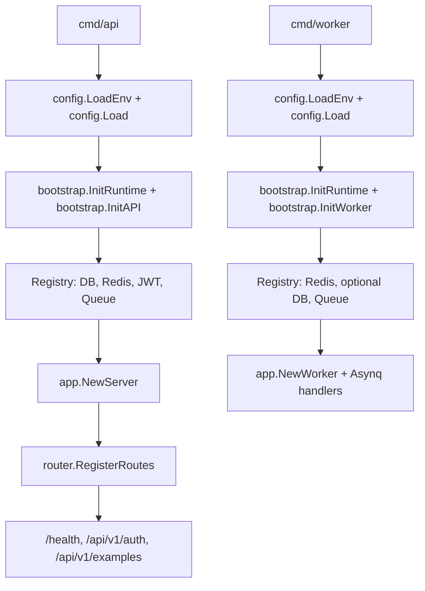

# Go Skeleton

**中文** | [English](./README.md)

这是一份从实际项目里抽离出来的 Go 服务骨架。业务模块已经清空，仅保留 `Example` 流程作为分层结构的示例。

**需要 Go 1.26+。**

## 目录结构

- `cmd/api`：HTTP API 进程。
- `cmd/worker`：Asynq worker 进程。
- `cmd/migrate`：example 表的最小化 GORM 迁移入口。
- `config`：环境变量加载与配置类型。
- `internal/bootstrap`：进程级资源初始化与生命周期管理。
- `internal`：应用装配、路由、中间件以及 example 分层代码。
- `pkg`：通用基础设施工具，包含通用 JWT 鉴权。

## 运行

```sh
cp .env.example .env
go run ./cmd/api
```

配置好 Redis 后运行 worker：

```sh
go run ./cmd/worker
```

配置好 Postgres 后运行 example 迁移：

```sh
go run ./cmd/migrate
```

## 运行时依赖

- API 进程必需 `POSTGRES`。
- Redis 对 API 进程可选；配置后会启用缓存与异步任务投递。
- Worker 进程必需 `REDIS_ADDR`。
- Postgres 对 worker 进程可选。
- 配置 `JWT_SECRET` 后才会启用 JWT 示例路由。

## 示例 API

签发示例 JWT：

```sh
curl -X POST http://127.0.0.1:3000/api/v1/auth/token \
  -H 'Content-Type: application/json' \
  -d '{"subject":"demo"}'
```

调用需要鉴权的示例接口：

```sh
curl http://127.0.0.1:3000/api/v1/auth/me \
  -H "Authorization: Bearer <access_token>"
```

Redis 已配置时投递示例异步任务：

```sh
curl -X POST http://127.0.0.1:3000/api/v1/examples/tasks \
  -H 'Content-Type: application/json' \
  -d '{"name":"demo"}'
```

## 启动流程



## API 契约

服务自带一份 OpenAPI 3.1 spec，位于 `api/openapi.yaml`。运行时通过下面的端点返回内嵌的 spec：

```
GET /openapi.json
```

把它导入 Postman / Bruno / Insomnia 或任意支持 OpenAPI 的工具即可浏览接口。spec 是请求/响应结构的唯一真相源；生成的 `internal/oapi/oapi.gen.go` 通过 `oapi.ServerInterface` 在编译期强制对齐。

修改 `api/openapi.yaml` 后重新生成：

```sh
make oapi          # 重新生成 internal/oapi/oapi.gen.go
make oapi-verify   # 生成产物与 yaml 不一致时失败（make verify 会调用）
```

## 部署说明

- OpenAPI spec 在构建期就已从 `api/openapi.yaml` 生成完毕，`internal/oapi/oapi.gen.go` 入库，部署时不需要再跑 codegen。
- `CORS_ALLOW_ORIGINS` 是逗号分隔的白名单；留空表示不下发 CORS 响应头。
- 离开本地开发前请替换 `JWT_SECRET`。
- 业务接口的错误用 JSON 信封 `code` / `msg` / `reason` 返回；按约定，绝大多数 API 错误也用 HTTP 200。
- `/health` 用真实 HTTP 状态码；必需依赖不可用时返回 503。

## 校验

提交前跑一站式检查：

```sh
make verify   # fmt + vet + test + lint + oapi-verify
```

也可以单独跑某一项（`make test`、`make lint` 等），完整列表见 `make help`。

## License

[MIT](./LICENSE).
